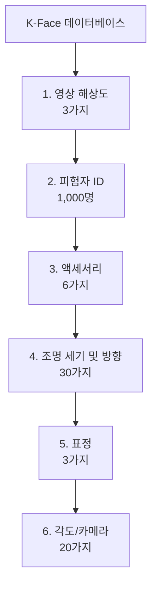

# K-Face 데이터베이스 구조 및 데이터 명명 규칙

본 문서는 **K-Face 안면 이미지 데이터베이스**의 계층 구조, 구성 요소, 파일명 명명 규칙 및 구축 수량 산출 방식을 설명합니다.

---

## 1. 데이터베이스 개요

K-Face 데이터베이스는 다양한 해상도, 피험자 ID, 액세서리 착용 여부, 조명 세기 및 방향, 표정, 카메라 각도 조건에서 촬영된 대규모 안면 이미지 데이터셋입니다.



---

## 2. 계층 구조 및 구성 요소

| 단계 | 항목 (Attribute) | 수량 | 세부 구분 내용 | 폴더/파일명 코드 예시 |
| :--- | :--- | :---: | :--- | :--- |
| **1단계** | **영상 해상도** | 3 | 고화질, 중화질, 저화질 | - |
| **2단계** | **피험자 ID** | 1,000 | A, B, C, D, E, ... (총 1,000명) | `S001` ~ `S1000` |
| **3단계** | **액세서리** | 6 | 비착용, 일반안경, 뿔테안경, 선글라스, 모자, 모자+뿔테안경 | - |
| **4단계** | **조명 세기 및 방향** | 30 | 1000 lux & 전체, 400 lux & 전체, 200 lux & 전체, 150 lux & 전체, 100 lux & 전체 등 | `L1` ~ `L30` (`L01`~`L30`) |
| **5단계** | **표정** | 3 | 무표정 (E01), 웃음 (E02), 찡그림 (E03) | `E01`, `E02`, `E03` |
| **6단계** | **카메라 각도** | 20 | 상단 0도 좌측 90도, 75도, 60도, ... (총 20개 위치) | `C1` ~ `C20` |

---

## 3. 파일명 명명 규칙 (Naming Convention)

최하위 폴더 내 이미지 파일명은 다음과 같은 형식으로 구성됩니다.

### 예시: `17111302_S001_L01_E01_C5.jpg`

- `17111302`: 세션 / 날짜 / 식별 번호 Prefix
- `S001`: 피험자 ID (**S**ubject ID)
- `L01`: 조명 조건 (**L**ighting Condition, L01 ~ L30)
- `E01`: 표정 (**E**xpression, E01: 무표정 / E02: 웃음 / E03: 찡그림)
- `C5`: 카메라 각도 ID (**C**amera Angle, C1 ~ C20)

---

## 4. 데이터 구축 수량 산출 방식

K-Face 전체 데이터베이스의 총 구축 수량은 각 조건의 조합(Cartesian Product)으로 계산됩니다.

$$\text{총 구축 수량} = 3(\text{해상도}) \times 1,000(\text{ID}) \times 6(\text{액세서리}) \times 30(\text{조명}) \times 3(\text{표정}) \times 20(\text{각도}) = 32,400,000\text{장}$$

---

## 5. 현재 샘플 데이터셋 정제 현황

> [!NOTE]
> **2019-01-007.안면이미지_sample** 폴더 내 정리 완료 현황

- **선택된 카메라 각도**: **C5, C6, C7, C8** (각 최하위 폴더 당 4장 유지)
- **제거된 카메라 각도**: C1~C4, C9~C20 (16장 제거)
- **최종 폴더 구조**:
  ```text
  c:\Users\rkfka\Desktop\2019-01-007.안면이미지_sample\
  └── S001 ~ S006\
      └── L1 ~ L30\
          └── E01 ~ E03\
              ├── *_C5.jpg
              ├── *_C6.jpg
              ├── *_C7.jpg
              └── *_C8.jpg
  ```
